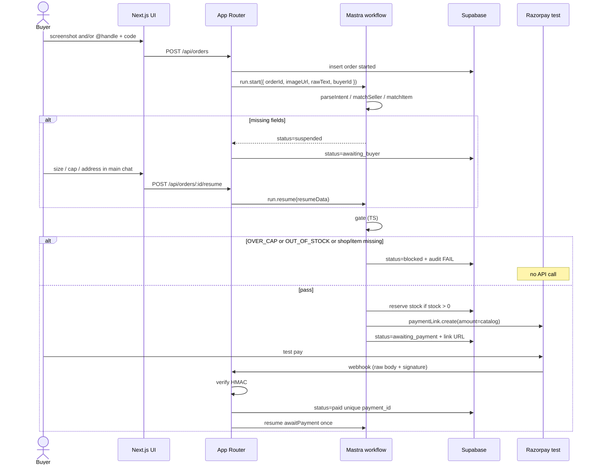

# Architecture

Truth lives in **Supabase Postgres**, not React state, not LLM memory.

Mastra workflow = transaction state machine (suspend / resume / snapshots).  
Agents = language only.  
Money tools run from **workflow steps after a TypeScript gate**.

## Data flow

```
Screenshot / text
  → insert orders row (status=started)
  → start Mastra workflow order-from-screenshot
       store mastra_run_id on the order
  → parseIntent (vision + text) → { youtubeHandle, itemCode, size?, capPaise?, notes }
  → matchSeller (exact normalized handle)
  → matchItem + read stock
  → collectMissing — suspend if size / cap / address missing
       → buyer agent collects in main chat
       → POST /api/orders/:id/resume  { size, capPaise, shipping… }
       → catch WORKFLOW_RESUME_ALREADY_CLAIMED (HTTP 409)
  → GATE (pure TS): stock available AND catalog_price_paise <= cap_paise
       no  → status=blocked, audit FAIL, watch chat explains, STOP
             never call Razorpay
       yes → atomic reserve
             create Standard Payment Link (amount === catalog_price_paise)
             expire_by = now+20m
             status=awaiting_payment
  → buyer pays on Razorpay test Checkout (the link)
  → webhook payment.captured | order.paid | payment_link.paid
       verify signature on RAW body
       amount must equal catalog_price_paise
       idempotent upsert on razorpay_payment_id
       status=paid, stock stays decremented (SOLD)
       append messages; if workflow is on awaitPayment, resume that step once
```



## Statuses

`started | awaiting_buyer | blocked | awaiting_payment | paid | expired | failed`

`block_reason`: `OVER_CAP | OUT_OF_STOCK | SHOP_NOT_FOUND | ITEM_NOT_FOUND | PAYMENT_FAILED`

Stock mentally: AVAILABLE → RESERVED (`awaiting_payment`, `reserved_until`) → SOLD (`paid`) or back to AVAILABLE (expired / failed). Hackathon: `expire_by` + script `scripts/release-expired.ts`. No pg_cron required.

## Stock race

```sql
UPDATE items
SET stock = stock - 1
WHERE id = $item_id AND stock > 0 AND is_active = true;
-- rowCount = 0 → OUT_OF_STOCK, do not call Razorpay
```

Paid does **not** decrement again. Expired reserve increments stock back by 1 iff `status = awaiting_payment` and `reserved_until < now()`.

## Layers

| Layer | Owns | Must not |
|---|---|---|
| `lib/gates.ts` | cap + stock boolean | Call Razorpay, call LLM |
| `lib/razorpay/` | Payment Link create, webhook verify | Read chat text as price |
| `lib/supabase/` | SQL, service role server-only | Leak service key to browser |
| `mastra/workflows/` | State machine | Let agents create charges |
| `mastra/agents/` | Language | Razorpay keys, catalog mutation |
| Next.js routes | Auth-ish demo session, resume, webhook | Trust client `status=paid` |
| UI | Render `orders.status`, chats, audit | Invent paid |

## Folder structure

```
nokon/
  README.md
  docs/
    PRODUCT.md
    ARCHITECTURE.md
    DEMO_SCRIPT.md
    schema.sql
    research/{versions,mastra,razorpay}.md
    knowledge/decisions.md
  src/
    app/                    # Next.js App Router
      page.tsx              # role pick
      seller/
      buyer/
      api/
        orders/route.ts
        orders/[id]/resume/route.ts
        webhooks/razorpay/route.ts
        chat/route.ts
    components/
      MainChat.tsx
      WatchChat.tsx
      StatusStrip.tsx
      AuditPanel.tsx
    lib/
      supabase/
      razorpay/
      gates.ts
      money.ts
    mastra/
      index.ts
      agents/
      workflows/order-from-screenshot.ts
      tools/
      schemas/
  scripts/
    seed.ts
    headless-happy.ts
    headless-over-cap.ts
    release-expired.ts
  .env.example
```

## Auth (hackathon)

Email / magic link is enough. Service role **server-only**. Browser uses the anon/publishable key + user JWT for Realtime on `messages` and `orders`. RLS can stay loose for the weekend if time is tight; never put the service key in a client bundle.

## Realtime

```sql
alter publication supabase_realtime add table messages;
alter publication supabase_realtime add table orders;
```

Client:

```ts
supabase
  .channel(`order-${orderId}`)
  .on('postgres_changes', { event: '*', schema: 'public', table: 'messages', filter: `order_id=eq.${orderId}` }, handler)
  .on('postgres_changes', { event: 'UPDATE', schema: 'public', table: 'orders', filter: `id=eq.${orderId}` }, handler)
  .subscribe()
```

## Env (names only)

See `.env.example`. Razorpay and Supabase service keys are server-side. `NEXT_PUBLIC_*` is limited to Supabase URL + anon key + optional app URL.

## Local webhooks

ngrok or cloudflared → `POST /api/webhooks/razorpay`. Dashboard test-mode webhook secret in `RAZORPAY_WEBHOOK_SECRET`. Test OTP `754081`.
